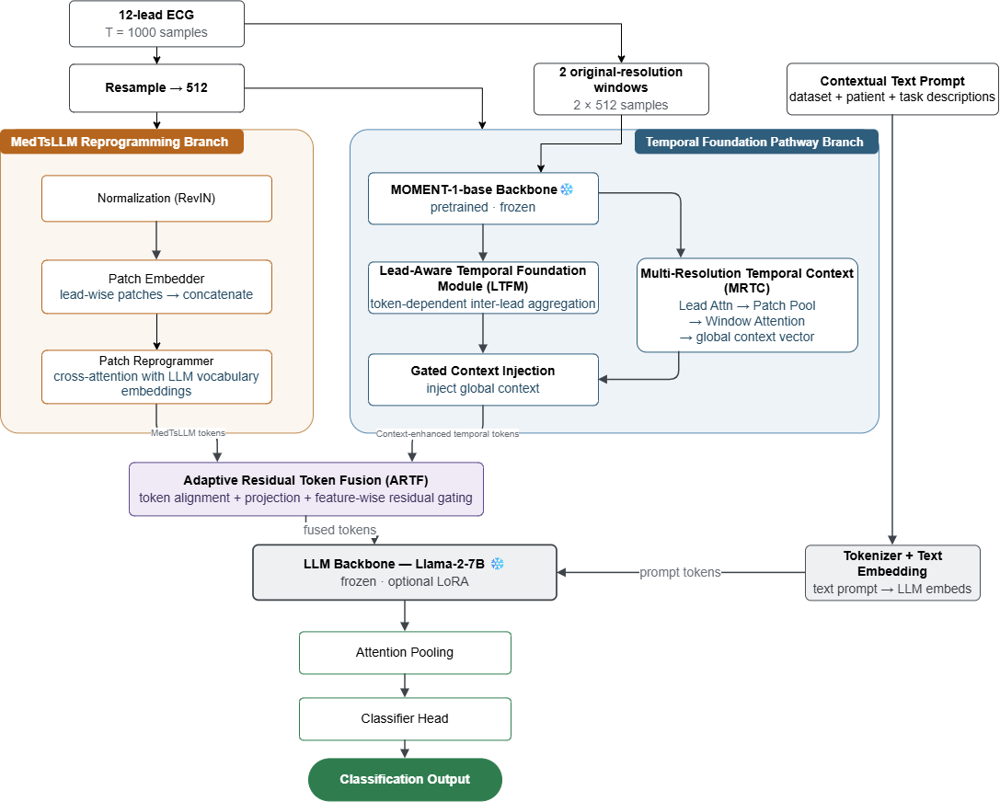

# LAF-ECG

<p>
  <strong>Multi-Resolution Lead-Aware Fusion of Time-Series and Language Foundation Models for ECG Classification</strong>
</p>

LAF-ECG extends MedTsLLM for ECG classification by combining the
MOMENT-1-base time-series foundation model with Llama-2-7B through
lead-aware, multi-resolution gated fusion.

The model is evaluated on:

- **PTB-XL** — 5-class diagnostic superclass classification
- **Chapman-Shaoxing** — 8-class rhythm classification

This repository builds on the original
[MedTsLLM](https://github.com/flixpar/med-ts-llm) codebase.

## Architecture

<p align="center">
  
</p>

## Setup

Clone the repository:

```bash
git clone https://github.com/kkianamm/LAF-ECG.git
cd LAF-ECG
```

Create and activate an environment using either Conda or venv:

Option 1: Conda
```bash
conda create -n lafecg python=3.11
conda activate lafecg
```
Option 2: venv
```bash
python3.11 -m venv lafecg

# Linux / macOS
source lafecg/bin/activate

# Windows
lafecg\\Scripts\\activate
```

```bash
pip install -r requirements.txt
```

### Hugging Face access

The experiments use:

- `AutonLab/MOMENT-1-base`
- `meta-llama/Llama-2-7b-hf`

Llama-2 requires Hugging Face access. After accepting the model license:

```bash
hf auth login
```

## Datasets

### PTB-XL

Dataset page:

https://physionet.org/content/ptb-xl/1.0.1/

Download and extract:

```bash
wget -c --show-progress \
  -O ptb-xl-1.0.1.zip \
  "https://physionet.org/content/ptb-xl/get-zip/1.0.1/"

unzip ptb-xl-1.0.1.zip
```

Place the extracted dataset under:

```text
data/ptbxl/
├── ptbxl_database.csv
├── scp_statements.csv
├── records100/
└── ...
```

The experiments use the 100 Hz recordings and the official folds:

```text
Train:      1-8
Validation: 9
Test:       10
```

### Chapman-Shaoxing

Dataset page:

https://physionet.org/content/ecg-arrhythmia/1.0.0/

Download and extract:

```bash
wget -c --show-progress \
  -O ecg-arrhythmia-1.0.0.zip \
  "https://physionet.org/content/ecg-arrhythmia/get-zip/1.0.0/"

unzip ecg-arrhythmia-1.0.0.zip -d ecg-arrhythmia-1.0.0
```

Place the extracted dataset under:

```text
data/chapman_shaoxing/
├── WFDBRecords/
│   ├── 01/
│   ├── 02/
│   └── ...
├── ConditionNames_SNOMED-CT.csv
└── ...
```

Then set the dataset path in:

```text
configs/datasets/chapman_moment_medtsllm.toml
configs/datasets/chapman_decoder.toml
```

to:

```toml
root = "data/chapman_shaoxing"
```

The experiments use the eight rhythm classes:

`SB, SR, AFIB, ST, AF, SA, SVT, AT`.

## Running the Experiments

### LAF-ECG

PTB-XL:

```bash
python train.py configs/datasets/ptbxl_moment_medtsllm.toml
```

Chapman-Shaoxing:

```bash
python train.py configs/datasets/chapman_moment_medtsllm.toml
```

### MedTsLLM baseline

PTB-XL:

```bash
python train.py configs/datasets/ptbxl_decoder.toml
```

Chapman-Shaoxing:

```bash
python train.py configs/datasets/chapman_decoder.toml
```

## Results

| Dataset | Accuracy | Macro-F1 |
|---|---:|---:|
| PTB-XL | **71.10%** | **62.43%** |
| Chapman-Shaoxing | **89.73%** | **65.94%** |

## Citation

Citation information will be added after publication.
